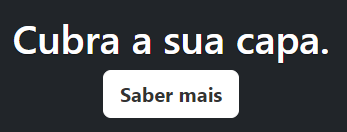
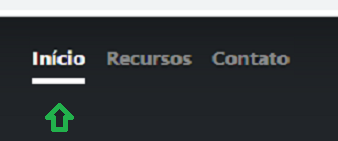
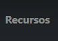
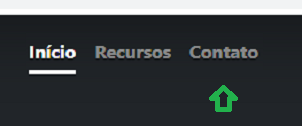

[Projeto - Aprendendo a escrever um README](#projeto---aprendendo-a-escrever-um-readme) 

[Descrição](#descri%C3%A7%C3%A3o)   

[Introdução](#introdu%C3%A7%C3%A3o)   

[Funcionalidades](#funcionalidades)   

[Tenólogias utilizadas](#tecnol%C3%B3gias-utilizadas)   

[Fontes consultadas](#fontes-consultadas)  

[autores](#autores)  
# Projeto - Aprendendo a escrever um README 

## Descrição:

É um site cujo o objectivo é construir páginas iniciais simples e bonitas.

<h4 align="center">
    :construction: 🚧 Projeto em construção 🚧 :construction:
</h4>

## Introdução: 

O site Modelo de Capa tem o objectivo de contruir páginas iníciais simples e bonitas. O site ainda está em construção 🚧. O site possui 4 funcionabilidades,cque são o 'Saíba mais', 'Início', 'Recursos' e 'Contato. Cuja as descrições estão sendo fornecidas no Indíce de funcionalidades do site.

## Funcionalidades:

- `Saber mais`: botão saber mais é utilizado para saber mais como funciona o site e saber como prosseguir.

 

- `Início`: botão início envia você de volta a primeira tela, a tela inícial do site.

 >

- `Recursos`:o botão recursos é utilizado para saber os recursos que o site oferece para os seus usuários.

 >

- `Contato`: botão de contato serve para o usuário entrar em contato com as pessoas responsáveis pelo site, caso o usuário tenha alguma dúvida ou algum problema a ser relato e consertado, caso seja um problema e não uma simples dúvida.

 

## Tecnológias utilizadas:

As tecnólogias utilizadas para a criação foram..

HTML

CSS

GitHub

Visual Studio Code

## Fontes consultadas:

[Alura](https://www.alura.com.br/artigos/escrever-bom-readme) - Como escrever um README incrível no seu Github

[lohhans](https://gist.github.com/lohhans/f8da0b147550df3f96914d3797e9fb89) - Um modelo para fazer um bom README

## Autores:

    Thalyta das Neves Ferreira 2A 