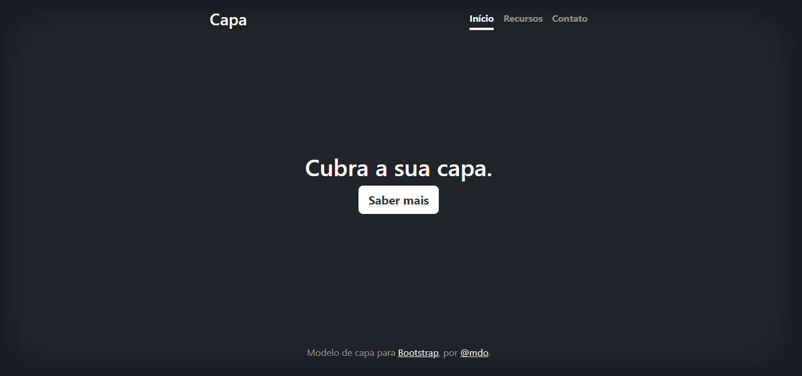

[Projeto - Aprendendo a escrever um README]  (projeto---aprendendo-a-escrever-um-readme) 

[#descri%C3%A7%C3%A3o]   

[#introdu%C3%A7%C3%A3o]   

[#funcionalidades]   

[#tecnol%C3%B3gias-utilizadas]   

[#fontes-consultadas]  

[autores]  
# Projeto - Aprendendo a escrever um README 

## Descrição:

## Introdução:

## Funcionalidades:

## Tecnológias utilizadas:

## Fontes consultadas:

## Autores: